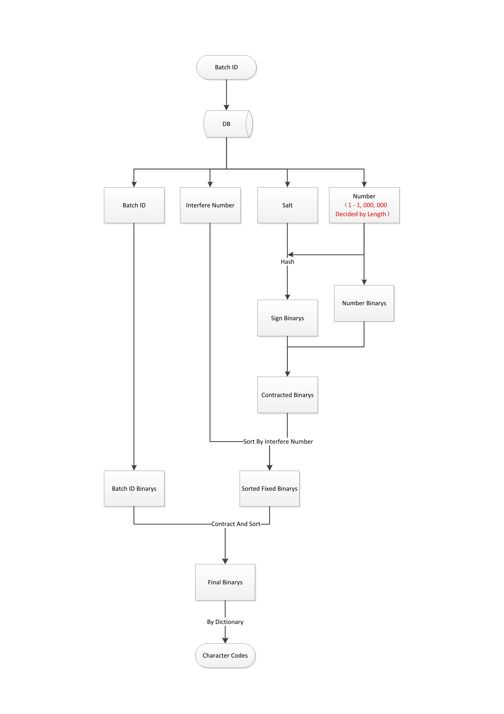
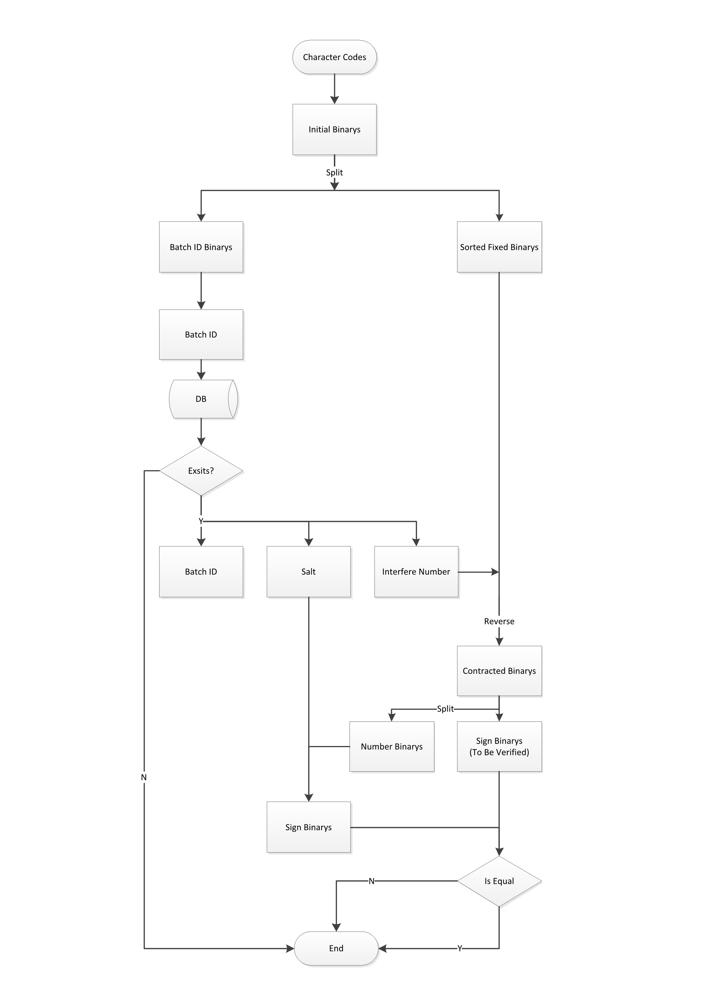

# LOTTERY-CODES
LOTTERY-CODES is a solution for generating and verifing lottery codes using PHP! With it, you can generate and sent codes to users without saved them, and verify the codes just by logical calculation.
## Demand and Inspiration

We were running a project, which need generate great amount codes like "TCLHN9PE4CNC" and saved them to database for prepaire to be verifed. So, we used much storage to save codes after be
benerated.

When we have a chance to refactor our project, we decision to improve the situation. I tried to find the possibility of generate & verify codes by encryption algorithm, to avoid keeping all the
generated codes in hard disk. Actually, a code can convert to many bin messages, which can be splited to several fixed parts. So, I can put any msg in one code, even the symmetric encrypt message
which can improve the code's security.

## Embryonic

Tried and tried again, I splite the bins to three parts: batch ID, codes number and encrypt message. With these message, I can generate codes by batches, each batch should generate several
codes of specific quantity and each code has fixed numbers, and the remaining bins to save symmetric encrypted sign.

### Flow chart for generate:

### Flow chart for verify:

## Problems and efforts
